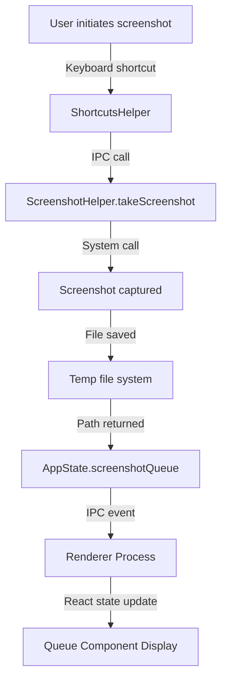
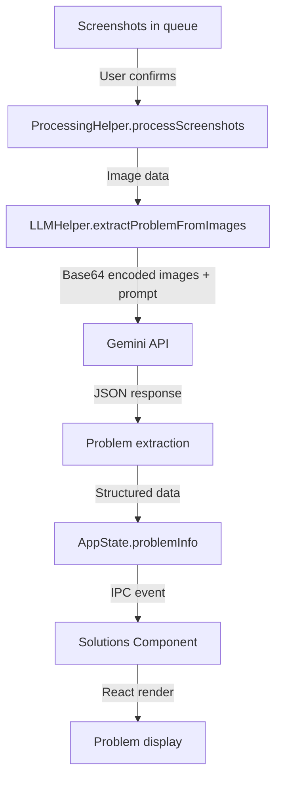
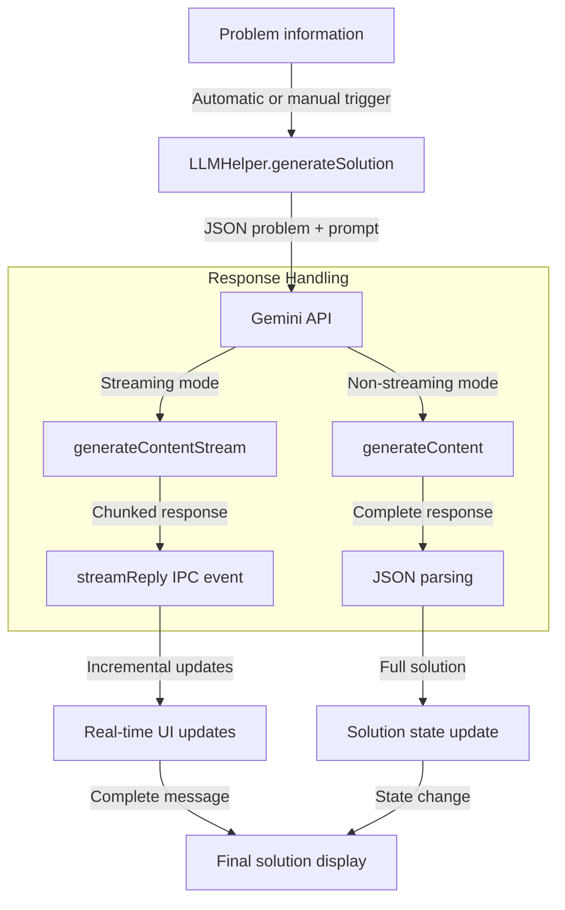
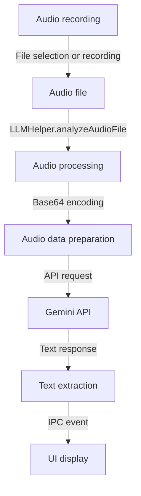
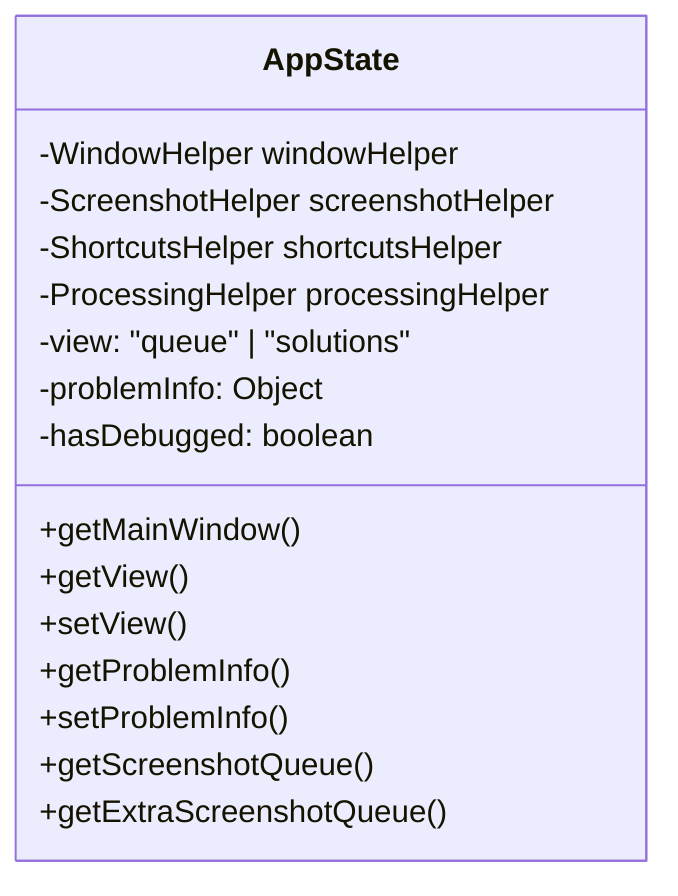
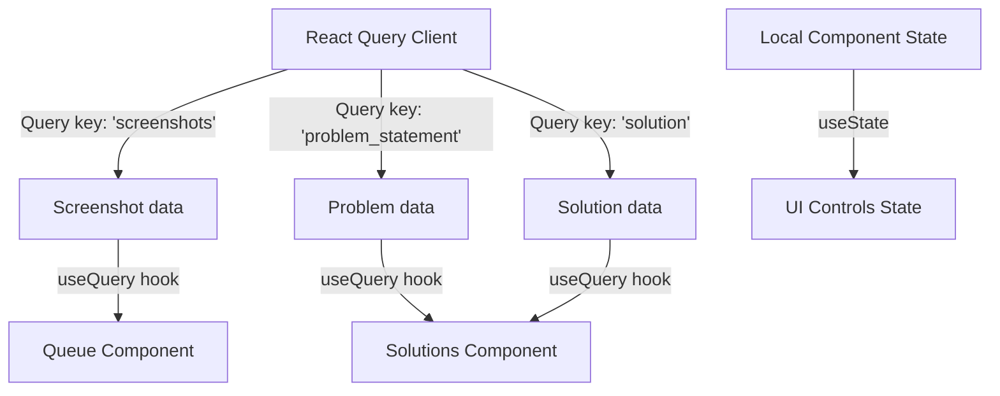
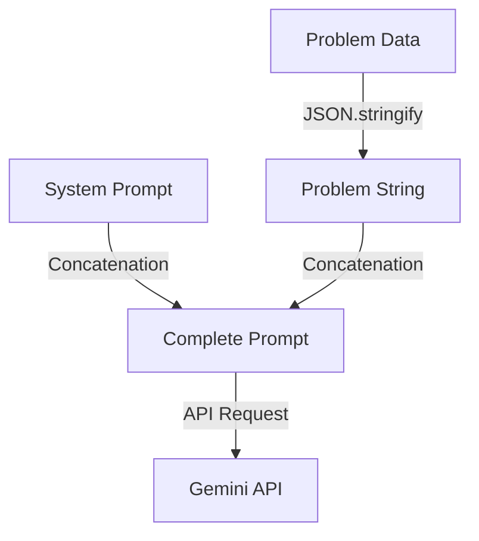
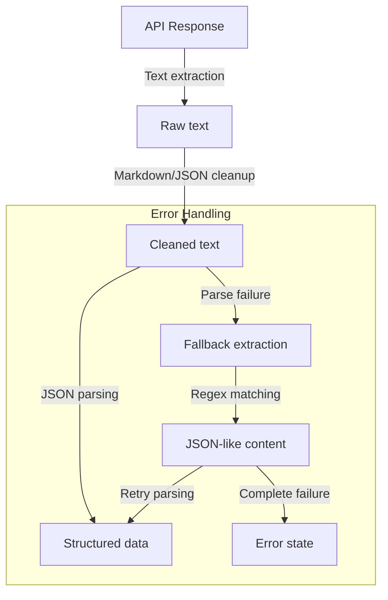
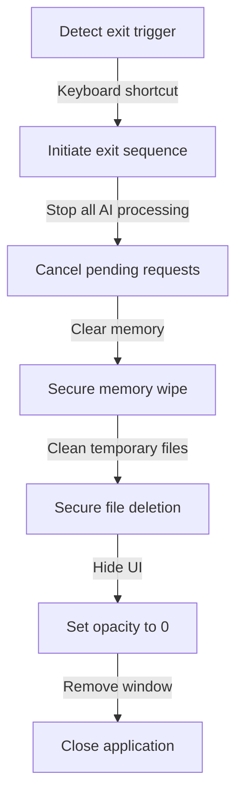

# clulley Data Flow Documentation

## Overview

This document details the flow of data through the clulley application, from user input capture to AI processing and response display. Understanding these data flows is essential for developers working on the codebase and for troubleshooting issues. All data flows have been designed with stealth and privacy as primary considerations, ensuring minimal visible footprint and maximum discretion.

## Core Data Flows

### 1. Screenshot Capture Flow



**Data Transformation:**
1. User input (keyboard shortcut) → Event trigger
2. Native screen image → PNG file on disk
3. File path → Queue state in React
4. Image data → Thumbnail preview in UI

### 2. AI Analysis Flow



**Data Transformation:**
1. Image files → Base64 encoded strings
2. Multiple images + system prompt → Single API request
3. API JSON response → Structured problem information
4. Problem data → UI rendering of problem statement

### 3. AI Solution Generation Flow



**Data Transformation:**
1. Problem structure → AI prompt construction
2. API request → Text or JSON response
3. Raw response → Cleaned and parsed solution object
4. For streaming: Text chunks → Incremental UI updates
5. Solution object → Rendered code and explanation

### 4. Audio Analysis Flow



**Data Transformation:**
1. Audio file → Base64 encoded string
2. Audio data + prompt → API request
3. Text response → Structured UI display


## State Management

### Main Process State

The AppState class in the main process manages several key state objects:



**Key State Elements:**
- Current view (queue/solutions)
- Problem information structure
- Screenshot queue contents
- Processing status

### Renderer Process State

React components maintain their own state using React's useState and useEffect, while global state is managed through React Query:



## Data Transformation Details

### 1. Image Processing

Screenshots undergo the following transformations:

1. **Capture**: Raw pixel data → PNG image file
2. **Preview**: PNG file → Resized thumbnail (using Sharp library)
3. **AI Processing**: 
   - PNG file → Base64 encoded string
   - Base64 string → inlineData object with MIME type
   - Multiple images → Parts array in API request

### 2. AI Prompt Construction



The system prompt defines the AI's behavior and the specific output format requirements.

### 3. Response Processing



## Cross-Process Communication

All data that crosses the main/renderer process boundary does so through the IPC (Inter-Process Communication) mechanism:

### Main → Renderer Events

| Event Name | Data Payload | Purpose |
|------------|--------------|---------|
| `stream-reply` | Text chunk | Streaming response updates |
| `screenshot-taken` | Path and preview | New screenshot notification |
| `problem-extracted` | Problem object | Problem analysis results |
| `solution-success` | Solution object | Complete solution data |
| `initial-start` | None | Processing started notification |
| `debug-success` | Debug results | Debug analysis complete |

### Renderer → Main Invocations

| Invocation | Parameters | Return Value | Purpose |
|------------|------------|--------------|---------|
| `take-screenshot` | None | Path and preview | Capture new screenshot |
| `generate-solution` | Problem info, stream flag | Solution object | Generate AI solution |
| `move-window-*` | None | None | Window positioning |
| `analyze-*` | File path or data | Analysis results | Process various inputs |

## Data Security and Stealth Implementation

### Sensitive Data Handling

1. **API Keys**: Stored in environment variables, never in renderer process
2. **User Input**: Processed in memory, with zero persistence after session
4. **File System**: Uses temporary storage with secure deletion after processing

### Data Transmission

1. **Gemini API**: Uses HTTPS with API key authentication
2. **Local Communication**: Process isolation through Electron's contextBridge
3. **Network Monitoring Protection**: Requests masked to avoid detection by network monitoring tools

### Visual Stealth Measures

1. **Frameless Windows**: No standard window decorations or identifiable UI elements
   ```typescript
   const windowSettings = {
     frame: false,
     transparent: true,
     backgroundColor: "#00000000",
     hasShadow: false
   };
   ```

2. **Transparency Control**: Dynamic opacity based on interaction state
   - Unfocused: 70% opacity
   - Focused: 85% opacity
   - Hidden mode: 0% opacity with click-through enabled

3. **Auto-Positioning Logic**: Window automatically moves to less conspicuous screen locations
   - Edge detection to avoid center screen placement
   - Smart positioning away from other application windows
   - Avoids predictable screen positions

4. **Content Privacy Features**:
   - Automatic content blurring when other applications are focused
   - Text scrambling during window transitions
   - Size minimization to reduce screen footprint
   - No taskbar or dock presence (`setSkipTaskbar(true)`)

## Caching and Performance

### Data Caching Strategy

1. **React Query**: Caches API responses with Infinity staleTime
2. **Image Previews**: Generated once and reused
3. **API Responses**: Cached in memory for quick reuse

### Optimized Data Flows

1. **Streaming Responses**: Chunks processed and displayed incrementally
2. **Throttled Events**: High-frequency events are throttled

## Debugging Data Flows

For development and troubleshooting:

1. **Console Logging**: Strategic points in data flow have logging
2. **Error Boundaries**: React components catch and display errors
3. **State Inspection**: React DevTools can inspect component state

## Edge Cases and Error Handling

1. **Network Failures**: Graceful degradation with error reporting
2. **Malformed API Responses**: JSON parsing with fallback extraction
3. **Missing Input**: Validation checks before processing
4. **Resource Constraints**: Memory usage monitoring and cleanup
5. **Stealth Compromise Detection**: Self-monitoring for visibility issues
   - Detects when window becomes too visible
   - Automatically adjusts opacity or position
   - Can self-hide if suspicious activity detected

## Stealth Mode Exit Strategy

A key component of the stealth implementation is the ability to quickly exit stealth mode when needed:



1. **Panic Button**: Escape key pressed 5 times rapidly
2. **Memory Clearing**: All sensitive data immediately wiped
3. **Visual Cleanup**: Instant opacity reduction to 0
4. **Process Termination**: Complete application shutdown with no traces

## Conclusion

The clulley application employs a carefully designed data flow architecture that balances performance, security, and user experience, with stealth as a primary design consideration. Every data path, visual element, and interaction method has been engineered to minimize detectability while maintaining full functionality. The multi-process nature of Electron is leveraged to maintain process isolation while enabling rich functionality through controlled data exchange via IPC mechanisms, all while ensuring the application remains virtually invisible to casual observers.